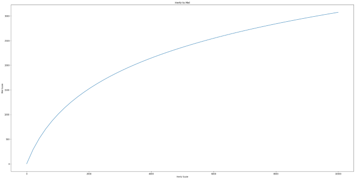

___
# History of Music
___

## Introduction
In the world of music, we can see that, there is a huge number of music genres and each of them have various qualities. Pop,EDM,HipHop and Rap,Latin,R&B,Country and Acoustic are some examples for them. Some music genres are made by combining two or more other genres. We can identify them as sub genres.

In this project, we are putting an effort to build a model which can express how a piece of music has evolved from various genres using machine learning. We are using a web interface to interact with the users. When a music file is given as the input through the web interface, the model will extract the music features and that features will be used to analyse the music genres. Then the results will be displayed in a user friendly manner through the web interface.

## Music Information Retrievel

temporal scopes for audio features

1. Instantaneous
2. Segment-level
3. Global

open-source python libraries 
- librosa, 
- jMIR, 
- ESSENTIA

Applications

- Genre classification
- Artist identification
- Instrument recognition
### signal domain features

1) Time domain
Zero crossing rate, amplitude envelope, and RMS energy are examples

2) Frequency domain
Signals are generally converted from the time domain to the frequency domain using the Fourier Transform

3) Time-frequency representation
obtained by applying the Short-Time Fourier Transform (STFT) on the time domain waveform

## Music Signal Features

### Low-level features 
Low-level features play a key role in extracting usefulinformation from a given input signal.

Some features ca be introduced as below.
1. Spectral Centroid

   A indication where the “centroid” of the frequency spectrum is located.
   The smaller the value is, the more energy is concentrated in the low frequency range.
2. Spectral Flux

   A measure of the rate of change of the signal spectrum which is calculated by comparing the spectrum of the current frame with the spectrum of the previous frame.
3. Spectral Contrast

   The difference in decibels between peaks and valleys in the frequency spectrum.
4. Zero-Crossing Rate
   
   The number of times a waveform crosses the horizontal time axis.
5. Root Mean Square Energy

   An indicator of loudness,
6. Mel-Scale Frequency Cepstral Coefficients (MFCC)

   *m = 1127 . ln (1+ f / 700 )*
   

   Mel Spectrograms are spectrograms that visualize sounds on the Mel scale as opposed to the frequency domain.

7. Constant-Q Transform (CQT)
   
   A 2D representation with logarithmic-scale centre frequencies.

### Mid-level features

1. Rhythm 

    The pattern of regular or irregular tensionand release in music.2.
 
2. Pitch
 
    The characteristic of a sound, specifically amusical tone that is described by the frequency.3.
 
3. Harmony
    
    The combination of notes ofsimultaneously sounded music known as chords.

### High-level features

    Also known as human driven features
    Examples: genres, moods, and sound characteristics

## System Architecture

## Data Flow

### Technologies

## Machine Learning Plan

## Team Members
1. E/17/012 Amarasinghe R A A U [[Website](http://www.ce.pdn.ac.lk/e17-batch/), [Email](mailto:e17012@eng.pdn.ac.lk)]

2. E/17/038 Chandrasekara C M A [[Website](http://www.ce.pdn.ac.lk/e17-batch/), [Email](mailto:e17038@eng.pdn.ac.lk)]

3. E/17/101 Gunathilaka S P A U [[Website](http://www.ce.pdn.ac.lk/e17-batch/), [Email](mailto:e17101@eng.pdn.ac.lk)]

## Supervisors
1. Dr. Dhammika Elkaduwa [[Website](http://www.ce.pdn.ac.lk/academic-staff/dhammika-elkaduwe/), [Email](dhammika@eng.pdn.ac.lk)]
2. Dr.  Sampath Deegalla[[Website](http://www.ce.pdn.ac.lk/academic-staff/d-s-deegalla/), [Email](sampath@eng.pdn.ac.lk)]

## Scrum master
1. Keshara Weerasinghe (keshara2032@gmail.com)
