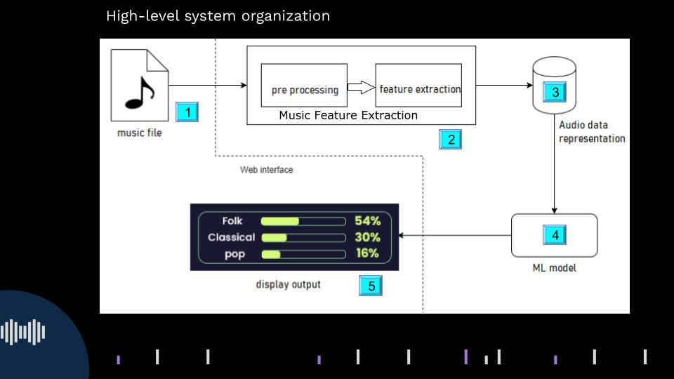
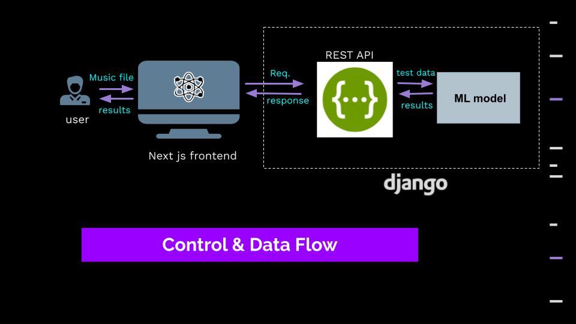
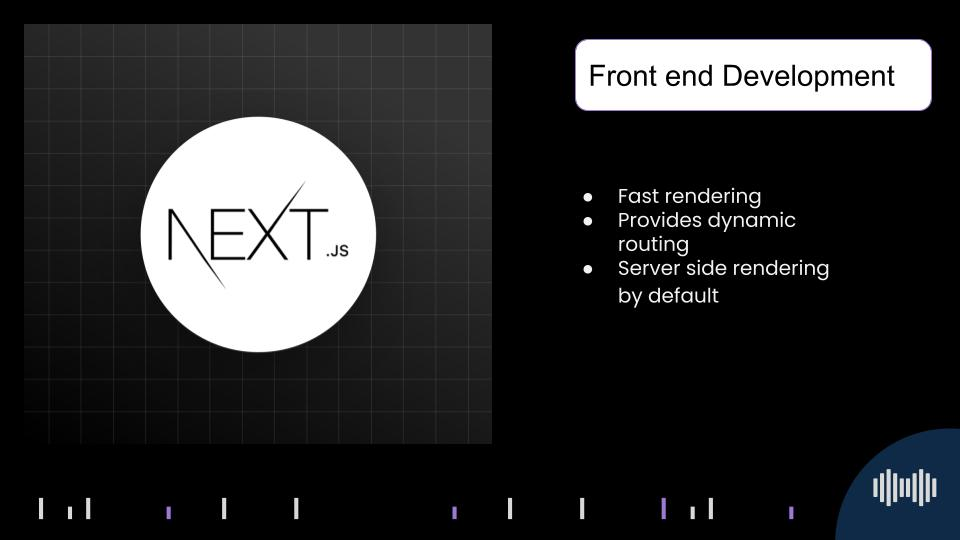
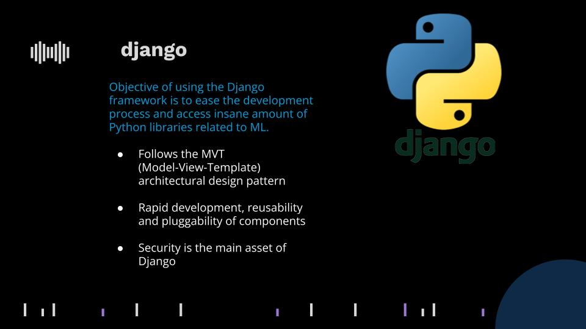
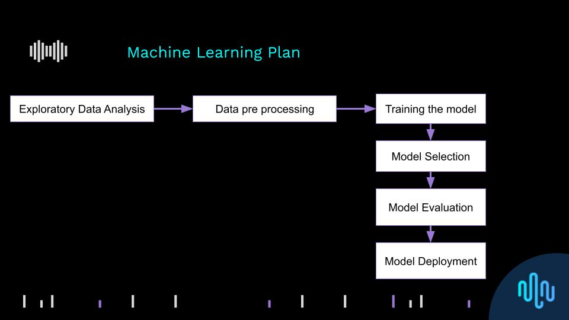

[comment]: # "This is the standard layout for the project, but you can clean this and use your own template"

# History of Music

---
## Introduction
In the world of music, we can see that, there is a huge number of music genres and each of them have various qualities. Pop,EDM,HipHop and Rap,Latin,R&B,Country and Acoustic are some examples for them. Some music genres are made by combining two or more other genres. We can identify them as sub genres.

In this project, we are putting an effort to build a model which can express how a piece of music has evolved from various genres using machine learning. We are using a web interface to interact with the users. When a music file is given as the input through the web interface, the model will extract the music features and that features will be used to analyse the music genres. Then the results will be displayed in a user friendly manner through the web interface.

## Music Information Retrievel

temporal scopes for audio features

1. Instantaneous
2. Segment-level
3. Global

open-source python libraries 
- librosa, 
- jMIR, 
- ESSENTIA

Applications

- Genre classification
- Artist identification
- Instrument recognition

## System Architecture

## Data Flow

### Technologies

## Machine Learning Plan

## Team Members
1. E/17/012 Amarasinghe R A A U [[Website](http://www.ce.pdn.ac.lk/e17-batch/), [Email](mailto:e17012@eng.pdn.ac.lk)]

2. E/17/038 Chandrasekara C M A [[Website](http://www.ce.pdn.ac.lk/e17-batch/), [Email](mailto:e17038@eng.pdn.ac.lk)]

3. E/17/101 Gunathilaka S P A U [[Website](http://www.ce.pdn.ac.lk/e17-batch/), [Email](mailto:e17101@eng.pdn.ac.lk)]

## Supervisors
1. Dr. Dhammika Elkaduwa [[Website](http://www.ce.pdn.ac.lk/academic-staff/dhammika-elkaduwe/), [Email](dhammika@eng.pdn.ac.lk)]
2. Dr.  Sampath Deegalla[[Website](http://www.ce.pdn.ac.lk/academic-staff/d-s-deegalla/), [Email](sampath@eng.pdn.ac.lk)]

## Scrum master
1. Keshara Weerasinghe [[Email](keshara2032@gmail.com)]

## Table of Contents
1. [Introduction](#introduction)
2. [Other Sub Topics](#other-sub-topics)
3. [Links](#links)

---

## Links

- [Project Repository](https://github.com/cepdnaclk/{{ page.repository-name }}){:target="_blank"}
- [Project Page](https://cepdnaclk.github.io/{{ page.repository-name}}){:target="_blank"}
- [Department of Computer Engineering](http://www.ce.pdn.ac.lk/)
- [University of Peradeniya](https://eng.pdn.ac.lk/)

[//]: # (Please refer this to learn more about Markdown syntax)
[//]: # (https://github.com/adam-p/markdown-here/wiki/Markdown-Cheatsheet)
